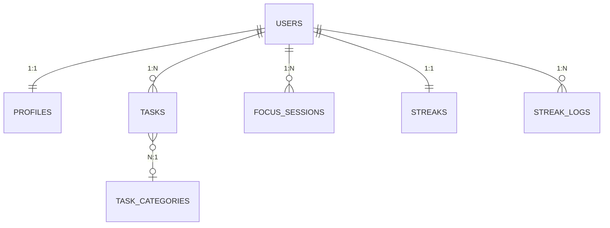

# 🚀 Taskflow — Smart Productivity & Focus App

Taskflow (branded as **TaskHub**) is a production-grade, MNC-level productivity application built with Flutter and Supabase. It combines advanced task management, Pomodoro-style Focus sessions, and GitHub-inspired gamification to help users master their time.

---

## 📸 Screenshots & Visuals
**Google Drive link **: https://drive.google.com/drive/folders/1_spwBbX8P1ZfUfSEBNS8KZ3LGYqT6wjo?usp=sharing.

## ✨ Key Features

### 📅 Smart Task Management
- **Intuitive Entry**: Create tasks with titles, markdown descriptions, and priority levels.
- **Dynamic Timeline**: Group tasks by time of day (Morning, Afternoon, Evening) with a 7-day strip filter.
- **Advanced Scheduling**: Precise date and time selection with past-date blocking.
- **AnyTime Tasks**: Handle unscheduled tasks with dedicated sections.

### 🎯 Focus & Pomodoro
- **Objective-Driven**: Start focus sessions with a specific goal and mini-subtasks.
- **Prescriptive Timers**: Select from 15, 25, 45, or 60-minute blocks.
- **Outcome Tracking**: Automatically logs completed sessions to your productivity stats.

### 🏆 Gamification & Profile
- **Daily Streaks**: Keep the fire alive with daily check-ins and task completions.
- **Contribution Heatmap**: A GitHub-style activity grid on your profile to visualize consistency.
- **Custom Branding**: Fully personalized categories and branding (Focus on TaskHub icon).

### 🔔 Intelligent Notifications
- **Task Reminders**: Automated pings 30 minutes before and exactly on time.
- **Daily Motivation**: Rotating pool of inspiring messages to start your day.
- **Streak Keep-Alive**: Evening reminders to ensure your streak doesn't break.

---

## 🛠️ Technical Stack

- **Framework**: [Flutter](https://flutter.dev) (Latest SDK)
- **State Management**: [Riverpod 3.0](https://riverpod.dev) (Optimistic UI & Caching)
- **Navigation**: [GoRouter](https://pub.dev/packages/go_router) (Declarative Routing)
- **Backend & Auth**: [Supabase](https://supabase.com) (PostgreSQL, Row Level Security)
- **Email Services**: [Resend](https://resend.com) via Supabase Edge Functions
- **Local Notifications**: `flutter_local_notifications` v20
- **Icons & UI**: Lucide Icons, Google Fonts, and Custom Premium Branding.

---

## 🏗️ Architecture

The project follows a **Domain-Driven Feature Architecture**, ensuring clean separation of concerns and high maintainability:

```text
lib/
├── app/          # App-wide routing, theme, and config
├── core/         # Shared services, widgets, and providers (HTTP, Storage, Notifications)
└── features/     # Feature-specific modules
    ├── auth/     # Login, Signup, Password Reset (Resend Integration)
    ├── dashboard/# Task lists, Timeline, Heatmap
    ├── tasks/    # Task creation, Models, Picker logic
    ├── focus/    # Pomodoro Timer, Subtask tracking
    └── settings/ # User preferences, Notifications control
```

---

## 🗄️ Database Schema (Supabase)



### Core Tables:
- `profiles`: User metadata and avatar synchronization.
- `tasks`: Core task storage with markdown support and sort orders.
- `focus_sessions`: Logs of timed productivity blocks.
- `streak_logs`: Daily activity records for the contribution heatmap.
- `user_settings`: Persistence for theme and notification preferences.

---

## 💎 Why It's Production Grade

- **Optimistic UI**: All UI operations (completing tasks, deleting) happen instantly locally before syncing to Supabase in the background.
- **Deep-Link Reset**: Secure password recovery flow using email confirmation with deep-link redirection back into the app.
- **Type Safety**: Use of `freezed` and strict domain models to prevent runtime crashes.
- **Offline-First Feel**: Robust caching ensure the app remains responsive even on slow connections.
- **Edge Security**: Automated Database Triggers and RLS (Row Level Security) prevent unauthorized data access.

---

## 🚀 Getting Started

### 1. Prerequisites
- Flutter SDK installed.
- A Supabase project created.

### 2. Environment Setup
Create a `.env` file in the root directory:
```env
SUPABASE_URL=https://your-project.supabase.co
SUPABASE_ANON_KEY=your-anon-key
```

### 3. Database Setup
Run the SQL script provided in `supabase_schema.md` (check the artifacts folder) in your **Supabase SQL Editor**.

### 4. Run the App
```bash
flutter pub get
# Generate app icons
flutter pub run flutter_launcher_icons
# Run the app
flutter run
```

---

## 📦 Download APK
**Apk Drive Link**:https://drive.google.com/file/d/1dJ8oITCOfFo-MJj_zoanxXC3zsC_BrRN/view?usp=sharing

---

## 🔑 Test Credentials
For testing purposes, you can use the following account:
- **Email**: `pratik.gdpandey@gmail.com`
- **Password**: `Admin123`

---

## 🗺️ Roadmap
- [ ] Apple/Google OAuth Integration.
- [ ] Collaborative Shared Tasks.
- [ ] Desktop Support (Mac/Windows).
- [ ] Advanced AI Task Suggestions.

---

## 📈 Development Journey

This project evolved through **20 intensive development phases**, including:
- **Phase 1-5**: Core architecture, Task CRUD, and basic UI.
- **Phase 6-10**: Supabase integration, Auth flows, and Focus sessions.
- **Phase 11-15**: Gamification (Streaks), Heatmap, and Profile management.
- **Phase 16-20**: Biometric security, Deep-linked password resets, Local notifications, and high-visibility UI polish.

---

## 📄 License
Custom License — All Rights Reserved.

---

*Built with ❤️ by Taskflow Team*
